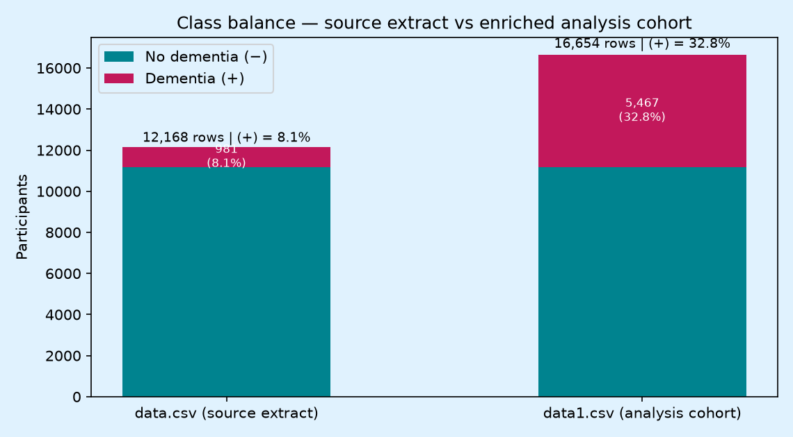
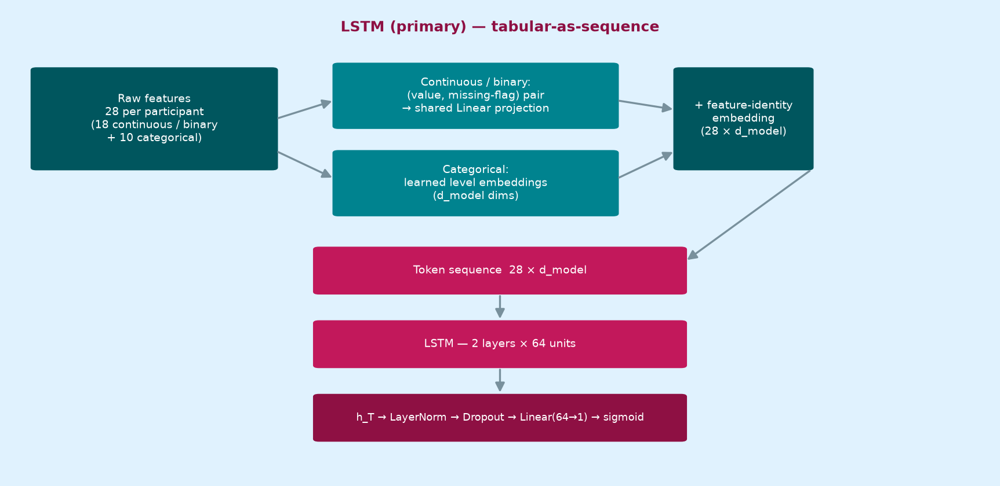
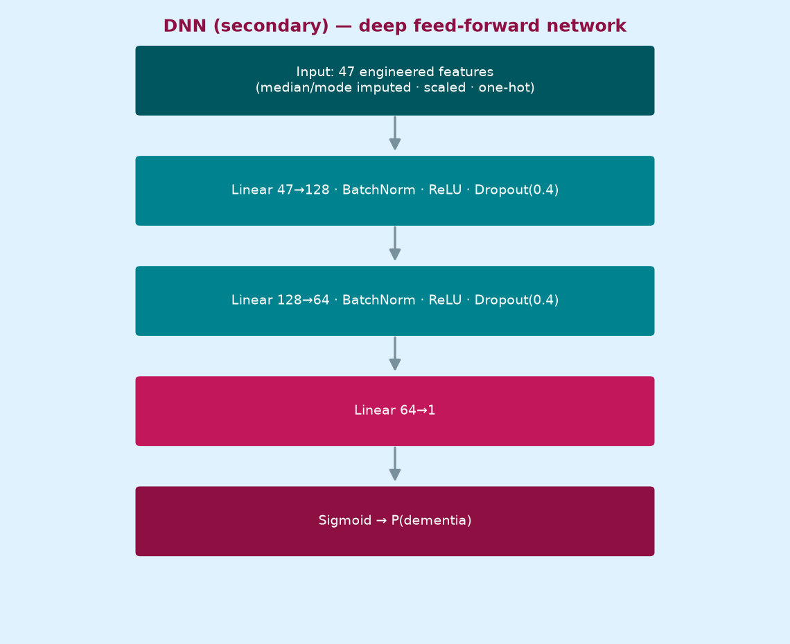
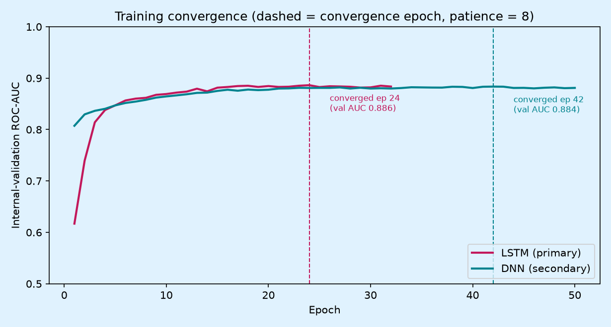
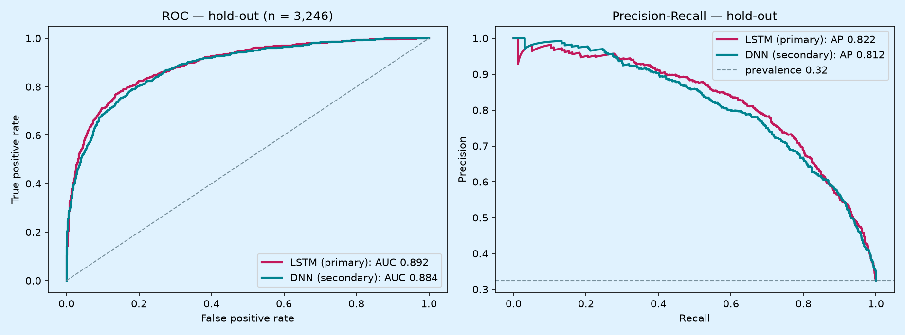
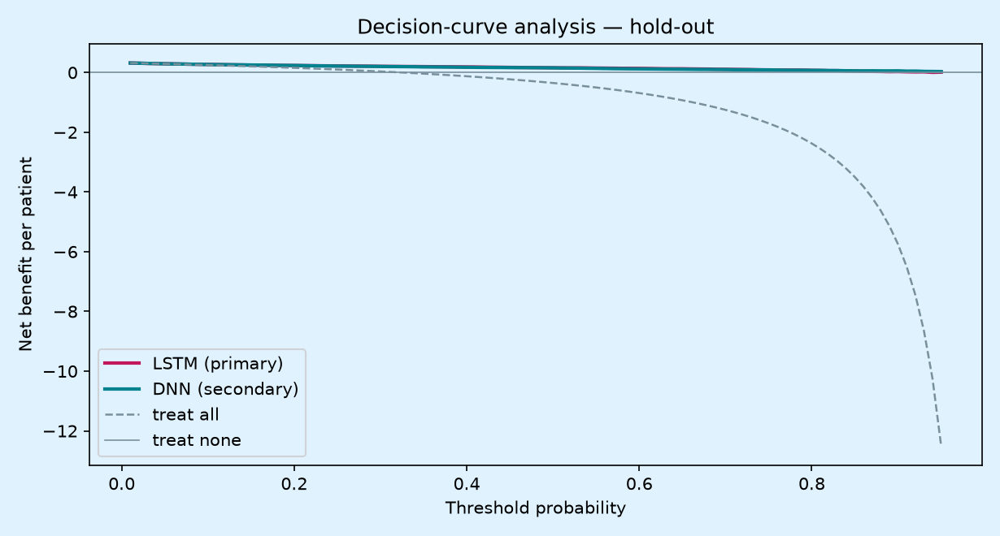

# Dementia Risk Prediction — Deep-Learning Screening Models (LSTM & DNN)

**Project:** `ml_dementia` · **Version:** 0.2 · **Date:** 2026-09
**Status:** Model development complete — internally validated, deployment-ready checkpoints exported

Screening models that estimate an individual's probability of dementia among adults aged ≥60
from routinely collectable field variables (sociodemographic, vascular/metabolic, lifestyle,
psychosocial, sensory and HIV-related). Two deep models are developed, tuned and compared under
one protocol:

| Model | Role | Architecture | Hold-out ROC-AUC | Hold-out PR-AUC |
|---|---|---|---|---|
| **LSTM** (tabular-as-sequence) | Primary | 28 feature-tokens → 2-layer LSTM (64 units) → head | **0.892** | **0.822** |
| **DNN** (deep feed-forward) | Secondary | 47 features → MLP 128→64 → head | 0.884 | 0.812 |

The paired comparison (`evaluations.ipynb`) finds the LSTM significantly better on ROC-AUC
(paired DeLong p = 0.039; bootstrap 95% CI [+0.0004, +0.0145]; McNemar p < 0.0001 on hard
decisions), while the DNN is 5× smaller (14.8k vs 72.3k parameters) and better calibrated out
of the box.

---

## 1. Project overview

### 1.1 Aim

Develop and internally validate deep-learning screening models for dementia among community-
dwelling adults ≥60, using only interview-collected variables — no neuroimaging, biomarkers or
specialist assessment. Performance targets: ROC-AUC ≥ 0.75 and sensitivity ≥ 0.80 at the
screening operating point.

### 1.2 Research questions

1. Can routinely collectable field variables support a screening tool with acceptable
   discrimination for use by primary-level health workers?
2. Does a sequence model (LSTM) extract more from the same tabular record than a dense network?
3. How do performance and calibration vary across subgroups (sex, urban/rural residence)?

### 1.3 Background (condensed)

- **Global burden:** ~57 M people living with dementia (2021), >60% in LMICs; ~45% of risk is
  attributable to 14 modifiable factors (Lancet Commission 2020/2024).
- **Africa:** pooled prevalence among adults ≥65 in Sub-Saharan Africa ≈ 6–10% with wide
  heterogeneity; >90% of cases undiagnosed; diagnostic infrastructure concentrated in capitals.
- **Zimbabwe:** no population-based prevalence study and no locally validated risk model;
  survey infrastructure (ZIMSTAT, DHS, MICS, STEPS) exists but has never carried dementia
  ascertainment.
- **Gap addressed here:** a locally developed, education-fair screening model using only
  community-measurable predictors, with the cognitive screen score deliberately quarantined
  from the predictor pool (it participates in outcome ascertainment — importing it as a feature
  would leak the outcome).

---

## 2. Data

| File | Role | Rows | Dementia (+) share |
|---|---|---|---|
| `data.csv` | Source extract (retained unmodified) | 12,168 | 8.1% |
| `data1.csv` | **Analysis cohort** — every source record kept, (+) class enriched to the design floor | 16,654 | **32.8%** |
| `data.sql` | SQL loader + data dictionary for the source table | — | — |
| `generate_data.py` / `generate_data1.py` | Seeded, reproducible data builders | — | — |



The enrichment exists because the source extract's 8% prevalence trained models that were good
at identifying (−) cases but weak on (+) cases. `data1.csv` keeps all source records and enriches
the (+) class to ≥ 31.9% of rows while preserving the survey imperfections of the source:
inconsistent date formats, sentinel codes (−99/88/99), categorical label chaos, missing values,
impossible values, logical contradictions and duplicates. The cleaning pipeline in
`modelx.ipynb` repairs all of them with a full rejection log; the cleaned table is exported to
`outputs/clean_data.csv` (16,229 rows, 32.5% positives).

**Predictor pool (28 features):** age, sex, education, residence, province, marital/employment
status, income (+ missing-indicator flag), hypertension/medication/diabetes/stroke, BMI, blood
pressure, HIV status, hearing/vision difficulty, depression score (GDS-15), head injury, family
history, smoking, alcohol, physical activity, diet, lives alone, social engagement.
**Quarantined:** `cognitive_screen_score` (leakage control).

---

## 3. Pipeline

1. **Ingest** `data1.csv` (only truly empty fields become NaN; the genuine `"None"` alcohol
   label is protected from default NA parsing).
2. **Clean** — deduplicate on `participant_id` (first-occurrence rule), sentinels → NaN,
   BP transpositions swapped, impossible values NaN'd or row-rejected with a logged reason,
   categories harmonised to controlled vocabularies, multi-format dates parsed, contradictions
   set to missing, eligibility age ≥ 60 applied last.
3. **Preprocess (split-first)** — stratified 80/20 train/hold-out (seed 42); median/mode
   imputation + standardisation + one-hot encoding fitted on train only; `income_missing` flag.
4. **Model** — LSTM (primary) and DNN (secondary), PyTorch on GPU (CUDA, mixed precision,
   cuDNN autotuner), BCEWithLogits + AdamW, early stopping on an internal stratified 10%
   validation split (patience 8, best weights restored), per-epoch training logs with explicit
   convergence statements, randomised hyperparameter search (3-fold, ROC-AUC) + tuned 5-fold CV.
5. **Evaluate once on hold-out** — ROC/PR, Youden's J and screening (max specificity at
   sensitivity ≥ 0.80) operating points, isotonic recalibration fitted on out-of-fold train
   predictions, subgroup AUCs, permutation importance.
6. **Compare** — `evaluations.ipynb`: paired DeLong + bootstrap CIs, McNemar, calibration/ECE,
   NRI/IDI, decision curves, subgroup stability, capacity/efficiency.

## 4. Model design

### 4.1 LSTM (primary) — tabular-as-sequence

The dataset is cross-sectional (one interview per participant), so there is no temporal axis to
model. The LSTM instead uses the standard *tabular-as-sequence* formulation: each of the 28
features becomes one token. Continuous/binary features enter as a (scaled value, explicit
missing-flag) pair through a shared linear projection; categorical features enter as learned
level embeddings; a learned feature-identity embedding marks *which* feature each token carries.
The LSTM reads the 28-token sequence and classifies from its final hidden state. With real
longitudinal follow-up, the same notebook would feed visit sequences instead — that is where
this architecture gains a true time axis.



- Tuned configuration (randomised search, 10 trials × 3 folds): `d_model 64 · hidden 64 ·
  2 layers · dropout 0.3 · lr 1e-3 · weight decay 0`
- Capacity: 72,257 trainable parameters · converged at epoch 24 (stopped 32, 12 s on GPU)

### 4.2 DNN (secondary) — deep feed-forward network

A plain MLP on the 47-column standardised + one-hot design matrix — the dense counterpart that
sees the same rows as an unordered feature vector.



- Tuned configuration (12 trials × 3 folds): `hidden 128→64 · dropout 0.4 · lr 1e-3 ·
  weight decay 1e-4 · batch 256`
- Capacity: 14,849 trainable parameters · converged at epoch 42 (stopped 50, 10 s on GPU)

### 4.3 Training behaviour



Both models converge quickly and early-stop well before the 100-epoch cap; per-epoch logs and
the convergence statement are printed by `modelx.ipynb` for every final fit.

## 5. Results (hold-out, n = 3,246; 1,054 events)



| Metric | LSTM (primary) | DNN (secondary) |
|---|---|---|
| ROC-AUC | **0.892** | 0.884 |
| PR-AUC | **0.822** | 0.812 |
| Brier (isotonic) | **0.118** | 0.124 |
| MCC @ Youden | **0.621** | 0.588 |
| Balanced accuracy @ Youden | **0.817** | 0.804 |
| Sensitivity @ screening (sens ≥ 0.80) | 0.801 | 0.801 |
| Specificity @ screening | **0.825** | 0.805 |
| Calibration slope (raw) | 0.814 | **0.934** |
| Trainable parameters | 72,257 | **14,849** |

**Paired significance tests** (same hold-out rows): DeLong p = 0.039 favouring the LSTM;
bootstrap 95% CI of ΔAUC [+0.0004, +0.0145]; McNemar p < 0.0001 on Youden decisions.

**Decision analysis:** the LSTM's net benefit is highest across the clinically plausible
threshold range; both models hold sensitivity ≥ 0.80 with 0.81–0.83 specificity at the screening
point — the class enrichment lifted (+)-case detection far above what the source prevalence
allowed.



Full depth (calibration curves/ECE, threshold sweeps, NRI/IDI, subgroup tables, tuning
robustness) lives in [`evaluations.ipynb`](evaluations.ipynb), with exported tables in
`outputs/benchmark/eval_*.csv`.

## 6. Deployment

Each final model is exported from `modelx.ipynb` as a **self-contained checkpoint** in
`outputs/checkpoints/`:

| File | Contents |
|---|---|
| `lstm_dementia_screening.pt` (+ `.md5`) | LSTM weights, fitted `SequenceBuilder`, isotonic calibrator, Youden + screening thresholds, tuned hyperparameters |
| `dnn_dementia_screening.pt` (+ `.md5`) | MLP weights, fitted sklearn `ColumnTransformer`, isotonic calibrator, thresholds, hyperparameters |

The `.md5` sidecar records the checksum at export time; verify before loading:

```bash
md5sum -c outputs/checkpoints/*.pt.md5
```

Each bundle reloads into a scoring pipeline in a few lines (the reload check inside
`modelx.ipynb` demonstrates it and asserts bit-level agreement with the hold-out probabilities):

```python
import torch
ckpt = torch.load("outputs/checkpoints/lstm_dementia_screening.pt", weights_only=False)
model = TabularLSTM(**ckpt["model_kwargs"])
model.load_state_dict(ckpt["model_state"]); model.eval()
builder = ckpt["transformer"]                      # raw feature frame -> token tensors
proba = torch.sigmoid(model(*builder.transform(new_records)))   # P(dementia)
flag = proba >= ckpt["operating_points"]["screening"]           # deployed threshold
```

## 7. Repository structure

```
ml_dementia/
├── data.csv                  # source extract (unmodified)
├── data1.csv                 # class-enriched analysis cohort (>= 31.9% positives)
├── data.sql                  # SQL loader + data dictionary for the source table
├── generate_data.py          # source-extract builder (seeded)
├── generate_data1.py         # analysis-cohort builder (seeded, enrichment + noise)
├── modelx.ipynb              # end-to-end pipeline + LSTM (primary) & DNN (secondary)
├── evaluations.ipynb         # in-depth paired comparison + recommendations
├── docs/                     # model-design diagrams & result figures (used here)
├── outputs/
│   ├── clean_data.csv        # cleaned analysis table
│   ├── rejection_log.csv     # cleaning audit trail
│   ├── benchmark/            # metrics.json + hold-out predictions + comparison tables
│   └── checkpoints/          # deployable .pt bundles + .md5 checksums
├── .venv/                    # local environment (CUDA PyTorch)
└── README.md
```

## 8. Running the project

```bash
# environment (once) — Windows + NVIDIA GPU
python -m venv .venv --system-site-packages
.venv/Scripts/python -m pip install torch --index-url https://download.pytorch.org/whl/cu130
.venv/Scripts/python -m pip install ipykernel
.venv/Scripts/python -m ipykernel install --user --name ml-dementia-gpu \
    --display-name "Python (ml_dementia GPU)"

# regenerate the analysis cohort, then run the notebooks
.venv/Scripts/python generate_data1.py
.venv/Scripts/python -m nbconvert --to notebook --execute --inplace modelx.ipynb
.venv/Scripts/python -m nbconvert --to notebook --execute --inplace evaluations.ipynb
```

Both notebooks target the `ml-dementia-gpu` kernel, use CUDA when available and fall back to
CPU with a printed warning. All splits, folds, searches and network initialisations are seeded
(`random_state = 42`) — re-runs reproduce the reported metrics.

## 9. Limitations

- Cross-sectional design — prediction/screening tool, not causal inference.
- No gold standard without biomarkers; outcome is clinician-consensus on a two-phase design.
- The (+)-class enrichment inflates effective prevalence relative to a natural stream; deployed
  thresholds and calibration must be re-derived on prospective data (the bundled calibrator is
  the mechanism to re-fit).
- Imported cognitive-screen cutoffs misclassify low-literacy respondents — the screen score
  stays quarantined from the predictor pool.

## 10. Key references (selected)

1. WHO. *Dementia* fact sheet (2025 update).
2. Livingston G, et al. *Dementia prevention, intervention, and care: 2024 report of the Lancet
   standing Commission.* Lancet (2024).
3. Prince M, et al. *10/66 Dementia Research Group criteria.* Br J Psychiatry (2007).
4. Guerchet M, et al. Dementia in Sub-Saharan Africa — prevalence reviews (~2016).
5. de Jager CA, et al. HAALSI/Agincourt dementia prevalence. Neurology (2017).
6. Allain TJ, et al. Abbreviated Mental Test in Zimbabwean elders. Cent Afr J Med (1996).
7. ZIMSTAT. 2022 Population and Housing Census; DHS 2015; MICS 2019.
8. WHO. Zimbabwe STEPwise NCD risk-factor survey (2014).
9. UNAIDS. AIDSinfo country profile: Zimbabwe.
